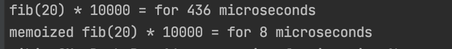
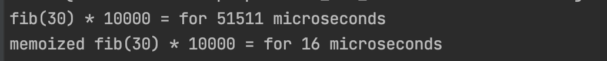

# Меморизация JS. 

**Меморизация** (запоминание, от англ. memoization) — в программировании сохранение результатов выполнения функций для предотвращения повторных вычислений. 
Это один из способов оптимизации, применяемый для увеличения скорости выполнения компьютерных программ. 
Перед вызовом функции проверяется, вызывалась ли функция ранее:

* Если не вызывалась, то функция вызывается, и результат её выполнения сохраняется;
* Если вызывалась, то используется сохранённый результат.

Меморизация в javascript используется через **замыкание** (см. [Замыкание](https://github.com/FreeNikita/preparation_for_inteview/blob/main/rus/404.md)) 

## Пример (см. [CodeSandbox](https://codesandbox.io/s/memoization-fkg91?file=/src/index.js))

```js

// Преобразование параметра
const argKey = x => x.toString() + ':' + typeof x;

// Генирация ключа
const generateKey = args => args.map(argKey).join('|');

// Меморизация
const memoize = fn => {
    const cache = Object.create(null);
    return (...args) => {
        const key = generateKey(args);
        const val = cache[key];
        
        if (val) return val;
        
        const res = fn(...args);
        cache[key] = res;
        return res;
    };
};
```

### Использование функции

```js
const sum = (a, b) => {
    let sum = 0;
    for (let i = a; i < b; i++) {
        sum += i
    };
    return sum;
};

const mSumBetween = memoize(sum);

console.log('Первый вызов mSumBetween(1, 10)');
console.log('Результат:', mSumBetween(1, 10));

console.log('Второй вызов mSumBetween(1, 10)');
console.log('Результат с кеша:', mSumBetween(1, 10));

console.log('Вызов mSumBetween(10, 20)');
console.log('Результат:', mSumBetween(2, 6));
```


## Оптимизация 

В данном блоке я хотел рассмотреть на сколько эффективно может быть применение **меморизации**
В примере будет использоваться классическая задача на числа Фибоначчи.
(см. [Фибоначчи](https://github.com/FreeNikita/preparation_for_inteview/blob/main/rus/404.md)).
Возможно пример не очень жизненный, но им можно хорошо нагрузить железо.

```js
// Количество проходов
const LOOP_COUNT = 10000;

// Функция замеряющая фремя выполнения
const speedTest = (name, fn, args, count) => {
  const tmp = [];
  const start = new Date().getTime();
  
// 10000 посчитать число Фибоначчию
  for (let i = 0; i < count; i++) {
    tmp.push(fn(...args));
  }
  
  const end = new Date().getTime();
  const time = end - start;
  console.log(`${name} * ${tmp.length} = for ${time} microseconds`);
};
```

Формула для подсчета числа Фибоначчи и меморизированая ее версия 
```js
const fib = n => (n <= 2 ? 1 : fib(n - 1) + fib(n - 2));
const mFib = memoize(fib);
```

Запуск тестов
```js
speedTest('fib(20)', fib, [20], LOOP_COUNT); 
speedTest('memoized fib(20)', mFib, [20], LOOP_COUNT);
```



### Смерть вашему ПК. (Я не советую запускать с числом больше 30)


